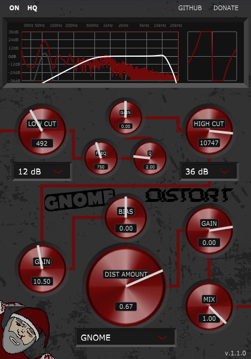

# GnomeDistort
#### Weird little distortion plugin

	

## Features

	

- pre-processing High- and Low-Cut with finely controlled Peak filter
- pre- and post-distortion gain with very high value ranges
- DC offset Bias
- Waveshaper with several unique and strange transforming functions

I made this both as a learning project and because I felt existing distortion plugins to be kind of 'tame'. I wanted something that lets me push gain to 36dB if I want to.
Since I don't know anything about functions usually used with waveshapers and have no foundational knowledge about them (which prevents me from understanding documents on the topic), almost every function comes just from me playing with a graph plotter.

<b>I'm actively interested in new functions; suggest them via issues!</b>

## Installation

If you like this software, please consider [supporting](https://ko-fi.com/crowbait).

#### Windows

Just grab your `.vst3` file from the [releases page](https://github.com/crowbait/robocopy-gui/releases) and put it into whatever folder you keep your VSTs in.
This plugin is compiled against x64 Windows and is tested on Win10 and Win11. It may or may not work on earlier versions.

#### MacOS

AFAIK, you can only build for MacOS <i>using</i> MacOS and XCode. I tried to get both running in a VM to build this plugin for you - I really tried - but it just didn't want to work. 
<b>If you have an idea on how to build this for MacOS without having an Apple device, let me know!</b>

So, while this is untested, this plugin should still run well on MacOS - you just need to build it yourself:

- Set up JUCE and Projucer (see tutorial video linked at the end of this file - don't worry, you only need to do the first steps)
- In Projucer, add AU to the plugin formats
- Change export and IDE to XCode
- Build from XCode

You <i>should</i> (again, can't test anything) get a perfectly fine AU-formatted plugin.

## Acknowledgements

- A huge thank you to [@matkatmusic](https://www.github.com/matkatmusic) who made [this epic tutorial](https://www.youtube.com/watch?v=i_Iq4_Kd7Rc) without which I could have never done this.
- Mo for his fantastic [gnome](Assets/gnome.png)